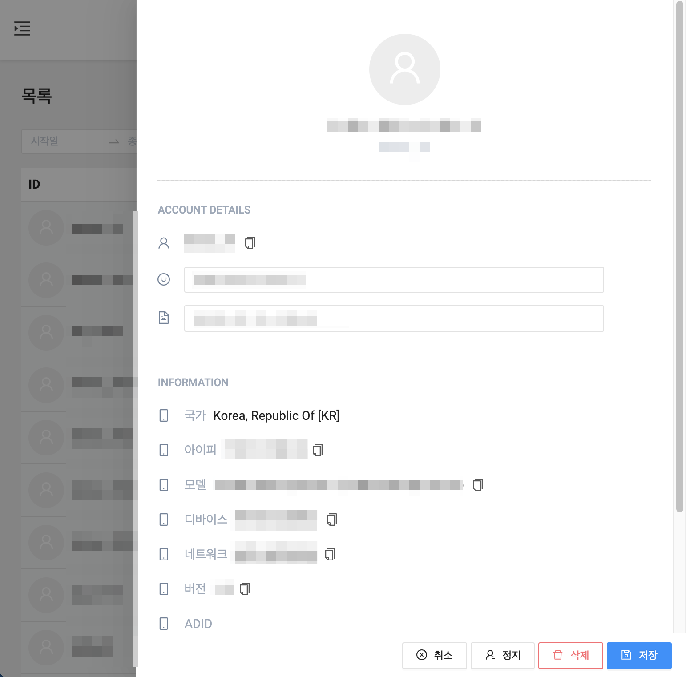

---
search:
  keyword: ['gamechat']
---

# Dashboard

NAVER CLOUD PLATFORM의 Game Chat에서 제공하는 대시보드에 대한 가이드입니다.

## Game Chat 대시보드 소개

**Q. 대시보드란?**

대시보드를 통해 채팅을 운영하고 관리하실 수 있습니다.

**Q. 대시보드에서 어떤 운영 기능이 포함되나요?**

대시보드에는 채팅 관련 통계 확인이 가능하고 NAVER CLOUD PLATFORM의 서비스와 연동하여 Papago 번역 등 다양한 기능을 제어할 수 있습니다.

## Game Chat 대시보드 시작하기

### 로그인

#### Step 1. 대시보드 접속

NAVER CLOUD PLATFORM의 콘솔에서 관리 페이지 URL을 클릭하여 대시보드에 접속합니다.

#### STEP 2. 회원가입

프로젝트 생성 시 등록한 관리자 계정으로 비밀번호 초기화 메일이 전송됩니다.

관리자 계정이 대시보드 관리의 모든 권한을 갖는 마스터 계정이 됩니다.

사용할 비밀번호와 대시보드에 보일 시간대를 설정하고 로그인합니다.

## 대시보드 메뉴 활용하기

## 운영

### 대시보드

대시보드에서는 접속 현황, 메시지, 통계 등의 채팅의 전반적인 운영 상황을 한눈에 파악할 수 있습니다.

날짜를 선택하여 그래프를 확인할 수 있습니다.

### 회원

#### - 목록

가입한 회원 목록이 표시됩니다.

가입일, ID, 닉네임, 국가, IP 등을 지정하여 회원을 조회할 수 있습니다.

사용자 ID를 클릭하면 상세 정보를 확인할 수 있습니다.

**정지** 버튼을 클릭하여 특정 회원을 이용정지할 수 있습니다.

- 이용정지 활성화 여부를 선택할 수 있습니다.

- KICK을 체크한 상태로 저장하면 회원이 참여되어 있는 모든 채팅에서 내보냅니다.

**삭제** 버튼을 클릭하여 특정 회원을 삭제할 수 있습니다.

**저장** 버튼을 클릭하여 회원 정보를 수정할 수 있습니다.

#### - 이용정지

특정 회원에 대해, 지정된 기간 동안 채팅에 접속할 수 없도록 합니다.

이용정지는 회원의 사용자 ID를 기준으로 적용됩니다.

이용정지된 회원들을 표로 확인할 수 있고 시작일, 아이디 등으로 조회할 수 있습니다.

**등록** 버튼을 클릭하여 이용정지할 회원을 추가할 수 있습니다.

회원을 클릭하면 이용정지 상세 내역을 확인할 수 있습니다.

**삭제** 버튼을 클릭하여 이용정지 내역을 삭제할 수 있습니다.

**저장** 버튼을 클릭하여 이용정지 내역을 수정할 수 있습니다.

### 채팅

채널을 확인하고 채팅을 전송할 수 있습니다.

**채널 추가** 버튼을 클릭하여 채널명을 입력해 채널을 추가할 수 있습니다.

**참여 목록** 버튼을 클릭하여 채팅 참여 인원 목록을 확인할 수 있습니다.

**채널 수정** 버튼을 클릭하여 채널 정보를 수정할 수 있습니다.

**삭제** 버튼을 클릭하여 채널을 삭제할 수 있습니다.

### 검색

프로젝트의 모든 채널의 메시지를 확인하고 검색할 수 있습니다.

발송 일시, 아이디, 닉네임, 메시지, 채널 ID 등으로 검색할 수 있습니다.

메시지 목록을 CSV 파일 형태로 다운로드할 수 있습니다.

**보기** 버튼을 클릭하여 상세정보를 확인할 수 있습니다.

**삭제** 버튼을 클릭하여 메시지를 삭제할 수 있습니다.

### 설정

Game Chat의 전반적인 환경을 설정하고 채팅을 운영하기 위한 다양한 키값을 입력하실 수 있습니다.

#### - 프로젝트 설정

프로젝트의 기본 정보를 확인하고 프로젝트명, 금칙어 설정 등을 수정할 수 있습니다.

Papago를 활성화하면 채팅 번역 기능을 사용할 수 있습니다.

네이버 클라우드와 연동을 위한 Papago 키값을 추가해야 합니다.

[NAVER AI Application 사용 가이드](https://docs.ncloud.com/ko/naveropenapi_v3/application.html)를 참고하여 키값을 입력해 주세요.

#### - 사용자 설정

프로젝트의 사용자를 확인할 수 있습니다.

**상세 보기** 버튼을 클릭하여 사용자의 상세정보를 확인하고 수정할 수 있습니다.

단, 현재 접속한 계정은 회원정보 수정에서 수정 가능합니다.

### 작업관리

각 메뉴에서 csv로 내보내기 한 결과를 30일간 다운로드할 수 있습니다.

## DOCS

### Unity

게임챗 Unity 사용 가이드로 이동합니다.

## 언어 변경

대시보드의 각 메뉴 등이 선택한 언어로 변경됩니다.

## 회원정보 수정

대시보드 이용 계정의 정보를 변경하실 수 있습니다.

### 내 정보 수정

로그인한 계정의 정보를 확인하고 이름과 프로필 URL, 대시보드 시간대를 변경할 수 있습니다.

프로필 이미지는 채팅 시 사용됩니다.

### 비밀번호 변경

현재 비밀번호와 신규 비밀번호를 입력해 비밀번호를 변경할 수 있습니다.

## 로그아웃

현재 계정에서 로그아웃하고 로그인 페이지로 이동합니다.
